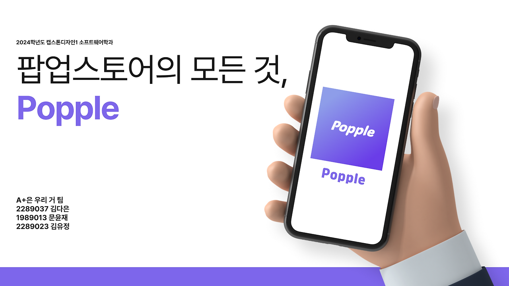

# POPPLE

> 📍 위치 기반 팝업스토어 정보 공유 Android 애플리케이션

POPPLE은 **MZ세대(20~30대)** 를 타겟으로  
현재 운영 중인 팝업스토어 정보를 지도 기반으로 제공하고,  
방문자 간 정보를 공유할 수 있도록 설계한 **모바일 애플리케이션**입니다.

<br>

## 🏆 수상 내역

- 교내 캡스톤 디자인 경진대회 **장려상 수상**

<br>

## 📽 데모 영상

🎥 실제 앱 동작 시연 영상 (카카오TV)  
https://tv.kakao.com/v/447395076

<br>

## 📌 프로젝트 개요

| 항목 | 내용 |
|------|------|
| 진행 기간 | 2024.03 ~ 2024.06 |
| 팀 구성 | 3인 팀 프로젝트 (캡스톤 디자인) |
| 개발 목적 | 흩어진 팝업스토어 정보를 한 곳에서 제공 · 방문자 간 현장 정보 공유 |

<br>

## 📸 시연 화면

**앱 소개**


**로그인 · 홈 · 지도 · 팝업정보 · 위시리스트**


**위시리스트 DB 저장**


**채팅 DB 저장**


<br>

## 🔍 주요 기능

**🗺️ 팝업스토어 탐색 & 지도**
- 현재 운영 중인 팝업스토어 목록 제공
- 지도 기반 마커 표시 및 마커 클릭 시 상세 정보 이동
- 위치, 운영 기간, 설명, SNS 링크 확인 가능

**❤️ 위시리스트**
- 관심 팝업스토어 하트 클릭으로 저장·삭제
- Firebase Realtime Database에 userId 기준 저장
- 위시리스트 화면에서 저장 목록 확인 가능

**💬 실시간 채팅**
- 팝업스토어별 채팅 공간 제공
- Firebase Realtime Database 기반 메시지 실시간 반영
- RecyclerView 기반 좌/우 채팅 버블 UI

<br>

## ⚙️ 기술 스택

| 구분 | 기술 |
|------|------|
| 플랫폼 | Android |
| 언어 | Java, XML |
| 백엔드 | Firebase Realtime Database |
| 인증 | Firebase Authentication |
| 지도 | Google Maps API |
| 디자인 | Figma |
| 개발 환경 | Android Studio |

<br>

## 🧱 데이터 구조 설계 (Firebase Realtime Database)

```
users/
 └ userId/
    └ wishlist/
       └ popupStoreId: true

popupStores/
 └ popupStoreId/
    ├ title
    ├ location
    ├ date
    ├ description
    ├ instagram
    └ website

chats/
 └ popupStoreId/
    ├ messages/
    │   └ messageId/
    │      ├ message
    │      ├ nickname
    │      └ timestamp
```

- 사용자 ID 기준 데이터 분리
- 팝업스토어 단위 데이터 관리
- 실시간 데이터 반영을 고려한 NoSQL 구조

<br>

## 👥 팀 구성 및 역할

### 👩‍💻 김다은 — PM · Firebase DB 설계 · 위시리스트 ([@Kimdaeun0929](https://github.com/Kimdaeun0929))
- 팀장 / PM · 일정 관리 및 역할 분담 · GitHub 협업 관리
- Firebase Realtime Database 전체 구조 설계
- userId 기준 사용자별 데이터 분리 저장 구조 설계
- 위시리스트 기능 구현 (저장·삭제 토글, 목록 조회)

### 👩‍💻 김유정 — UI 구현 · 실시간 채팅 ([@Hello11234567](https://github.com/Hello11234567))
- XML 레이아웃 구현 및 화면 구성
- RecyclerView + ChatAdapter 기반 채팅 메시지 리스트 구현
- 사용자 닉네임 비교를 통한 좌/우 채팅 버블 UI 구현
- Firebase Realtime Database 기반 채팅 메시지 실시간 반영
- SharedPreferences를 활용한 채팅방 목록 로컬 저장

### 👤 기타팀원 — 로그인 · 지도 · 팝업정보 페이지
- 로그인 및 회원가입 기능 구현
- Google Maps API 기반 위치 기반 지도 기능 구현
- DB 데이터를 불러와 화면에 표시하는 팝업정보 페이지 구현
- UI/UX 디자인 및 초기 목업 제작

<br>

## 💡 기술적 고민과 해결

**사용자별 데이터 관리 (김다은)**  
Firebase Authentication으로 userId를 식별하고  
userId 기준으로 위시리스트 데이터를 분리 저장해 사용자별 독립적인 데이터 관리를 구현했습니다.

**위시리스트 중복 저장 문제 (김다은)**  
하트 버튼 클릭 시 popupStoreId 기준 토글 방식을 적용해  
중복 데이터 저장을 방지하고 저장·삭제를 하나의 로직으로 처리했습니다.

**채팅 메시지 실시간 반영 (김유정)**  
Firebase Realtime Database의 데이터 변경 감지를 활용해  
새 메시지가 저장되면 즉시 화면에 반영되는 실시간 채팅을 구현했습니다.

**채팅 버블 UI (김유정)**  
RecyclerView와 ChatAdapter에서 사용자 닉네임을 비교해  
내 메시지는 오른쪽, 상대 메시지는 왼쪽 버블로 표시했습니다.
